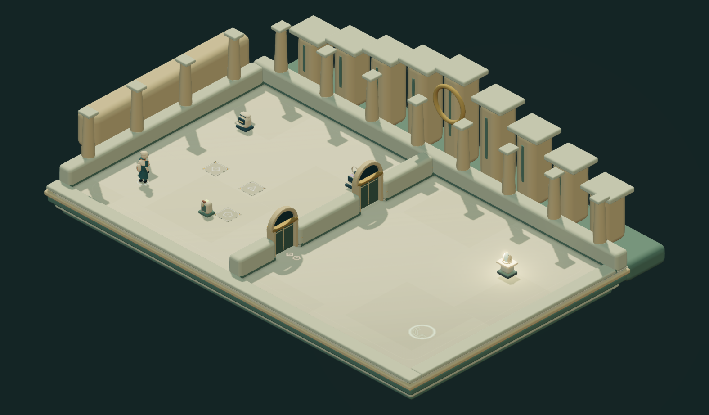

# ECHO HEIST / 回声劫案

一个关于配合、身份和记忆归属的 2.5D 潜入解谜游戏。你的同伙是过去十二秒里的自己：录下行动、安排回声出场，再让现在的你完成交接、取证与撤离。

当前版本 **0.28.1**。八章主线、48 个任务、131 个必经行动区，另有 35 个分支布局、6 份通关契约、4 个机制演习和 3 个基础演习。所有内容本地运行，支持单 HTML 离线版。

0.28.1 清理场景中已不显示的旧家具模型、对应加载代码与鸣谢，离线文件更小；画面、关卡与存档不变。

0.27 统一人物与设备造型：玩家、守卫、追踪者和回声使用面具、壳状披肩与更简洁的哑光材质；家具、柜台、拨杆和目标台也换为同一套造型。真实持票、交互、留守和回声重放继续由原模拟状态驱动。

默认让场景占据画面。点击「行动计划」或按 G，展开录像、时序、预演、任务说明与行动档案；阅读和编辑时暂停计时，返回场景后继续。手机使用跟随近景，仍可切换全景；渲染与标记按实际窗口比例适配。



[角色模型](docs/characters-v027.png) · [行动计划](docs/scene-v027-plan.png) · [车站](docs/scene-v028-station.png) · [总库](docs/scene-v028-vault.png) · [回声留守](docs/scene-v028-held.png) · [手机](docs/scene-v028-phone.png)。

0.28 为八章制作不同的建筑轮廓、墙体节奏、台基层次与背景：旧馆拱廊、拍卖会翼状顶棚、堆叠档案库、配电塔、站台列车、转存环、市政柱廊和封闭总库。全景镜头按真实建筑范围取景；装饰不进入可走区域，原有谜题与录像坐标保持一致。

踩板、门、馈线与终端通过动作和短光路反馈真实状态；交接成功、留候、失败使用不同形状，凭据只出现在实际持有者手中或真实柜槽。回声终点待命与投影失效各有标记，时段装置在靠近时显示时钟环，警戒环随实际警觉增长。序章前两关逐步突出踩板、录像和目标位置，详细规则仍在行动计划里。

四项美术计划的制作与本地验证已完成，最终离线包与发布状态见 [制作状态](docs/production-status.md)。美术参考 [COCOON 官方画廊](https://www.cocoongame.com/)的形体与材质方向，没有引入其图像或模型。当前仍采用原有平面关卡的固定 2.5D 视角；不把这一轮造型统一称作达到 COCOON 的最终美术完成度。

0.24 增加通关后的「夜班委托」。历史完成八章主线后解锁，每次提供空站交接、夜班检修、独立见证各一份委托，可免费换单。每类有两套手工安排：送件后兼任开门 / 限时签入、原路恢复馈线 / 北进南出换线、值守植入 / 两位见证人错峰调查。接单后布局与条件固定，刷新可继续；主线、独立试玩和契约使用各自的存档与录像。

每份契约仍是十二秒，回声名额按安排限制为一名或两名。唯一原票必须实际流转，借用线路必须归位，独立见证必须由守卫取证并返回登记台。成绩只记真实交差的成功回合：最快时间和最少回声分别保存，可来自不同次完成；重试、重录和预演不会被当成新的成功纪录。

查看 [夜班委托选单](docs/contracts-v024-board.png) · [空站交接](docs/contracts-v024-station.png) · [双路检修](docs/contracts-v024-power.png) · [独立见证](docs/contracts-v024-witness.png)。

0.23 让最后一次行动回到第一扇门。总库完成交付后，你带着前面取得的身份恢复回执重返序章旧馆：相同的入口、开关、通道和失物柜，让一名回声守门，由本人把回执交进柜槽，再从来时的门离开。木柜的空白铭牌恢复为“沈舟”，回执实际留在柜里。之后带着馆方签收联前往旧渡口，两种结局各自的后果保持不变。

回执只在恢复身份并成功到达锚点后保存，预演不能提交；中途重试从入站状态恢复，回退到恢复身份之前会撤销它。已通关旧版的规范行动记录可以续接新增旧馆段，历史结局保留；新版回执损坏会回到取得回执的锚点。

查看 [序章的空白铭牌](docs/museum-v023-before.png) · [终章归档后的失物柜](docs/museum-v023-restored.png)。

同版接上房间过渡：主线 83 处规范阶段连接显示离开与抵达的地点，并从真实入口短暂聚焦后淡入全景。配电室区分货梯、检修口与返回路线；车站按实际交票结果抵达 FAST 北侧或 SERVICE 南侧，再从共同的东南通道进入档案室；总库到旧馆明确是一段街区行程。入口增加楼梯、检修口和门槛标识，凭据和留守者沿用已保存的真实状态。

过渡可跳过，也遵循减少动态效果设置；下一段保持准备状态，由玩家开始十二秒。按住的旧方向键不会带入新房间，刷新从已保存的目的地继续。查看 [车站行程](docs/journey-v023-station.png) · [配电室入口模型](docs/passage-v023-power.png) · [返回旧馆](docs/journey-v023-museum.png)。

0.22 重做角色外形：较修长的比例、圆润面部、便帽、收腰外套与分片衣摆，玩家使用青绿大衣和铜色围巾，守卫使用蓝色制服，追踪者携带紫色核验设备。新模型跟随原骨骼动画，持票、交互和回声使用真实模拟姿态。旧馆等正式建筑增加扇形窗门楣，窗格月光投到地面，壁灯亮度收敛并保留冷暖层次。

0.22 把证据准备接到市政档案、市政厅与中央总库，新增 7 个布局。C1-6 的交付账本用于 C2-1：先在货运窗口通过收货侧廊，下一段从规程柜背面进入。C5-6 的批准书与 C6-3 的时间戳用于 C6-5：借用独立复核线路取证，再由真人或回声归位，末段在恢复后的线路上签入。C6-6 的传输地址与 C6-4 的联锁日志用于 C7-1：两名回声接应侧门、恢复联锁，并在连续复核台协作签名。三场任务的原方案保留。

独立复核台使用石材柜面、文件托盘与签章装置；门禁供电连线也显示“断电可用”的反向条件。八章现在各有一组出发准备，证据只改变设施与人员安排，不代做交接、签名、复位或最终送达。

查看 [收货侧廊](docs/scene-v022-dock.png) · [独立复核台](docs/scene-v022-review.png) · [总库收件核验](docs/scene-v022-intake.png)。

0.21 继续细化 2.5D 场景：提高后墙并补上柱式和檐口，窗内显示夜间街景；旧馆使用拼花木地板，玻璃展柜陈列怀表、浑仪和发报器。柱式小构件合批渲染，前景切墙与原始碰撞规则保持一致。旧班柜采用木材与黄铜，人工柜采用蓝色钢板与铆钉，接线提示按实际供电状态变化。

0.21 新增两组证据准备、六个布局：C3-6 恢复的供电与 C4-3 的旧班次记录用于 C4-5，安排两名回声值守，换取不限时段的旧台复核；C4-6 的货单与 C5-2 的人工权限用于 C5-5，真人在抑制区取件并送出，回声负责签入，末段由本人接回原票。原有方案继续可选。

0.20 重新调整夜间美术：冷色主光与暖色壁灯、墙脚接触阴影、木材与石材表面凹凸、拱窗、墙裙、檐口和可见的建筑底座。玩家采用长外套、铜色围巾与皮革背包。桌面加入轻微灯光晕染和抗锯齿；手机与简洁画面保留轻量渲染。全部显示从同一个 3D 场景生成。

0.20 把 C2-6 的转运总表与 C3-4 的专线接口接入 C3-5《只留一条供电线》。原方案依靠同伙按时切电；旁路方案安排两人分别值守，真人处理取件、归位和监控复位。自动接线柜具有独立模型、确认位标签与随供电变化的地面连线。

0.19 让证据进入出发准备：C0-4 的检修图可在 C0-6 打开旧馆北侧机械通道；C1-1 的时刻表与 C1-4 的岗位记录可在 C1-6 改变迎宾扫描和双人核验窗口。在这两场任务的「修表铺 · 出发准备」查看证据来源、改变的设施与配合代价。首次出发后锁定安排；重新准备会清空本次所有阶段的录像和锚点，已取得的证据与章节解锁保留。

查看 [检修门闩与回声配合](docs/preparation-v019-museum.png) · [修表铺的宴会准备](docs/preparation-v019-watchmaker.png)。

此前的 [0.22 旧馆画面](docs/scene-v022-museum.png)保留供对照。

查看 [角色模型](docs/characters-v022.png) · [新版人物近景](docs/scene-v022-player.png) · [三名回声配合](docs/scene-v022-team.png)。

场景采用真实 3D 模型、骨骼动画、材质与实时阴影，以固定等距镜头游玩。旧馆使用木地板镶边、城市旧影和失物展柜，[车站场景](docs/scene-v017-station.png)使用石材分区、时钟与双面交接柜。玩家、普通守卫、追踪器和回声分别有不同的服饰轮廓，凭据显示在实际持有者手中或柜槽里。

0.18 补齐其余六章的空间风格：[拍卖会](docs/scene-v018-gala.png)的帘幕与地毯、[市政档案](docs/scene-v018-records.png)的文件架、[配电站](docs/scene-v018-power.png)的管线与拨杆柜、[转存设施](docs/scene-v018-retention.png)的吸声板、[市政厅](docs/scene-v018-civic.png)的石材与登记柜、[中央总库](docs/scene-v018-vault.png)的金属库门。电源拨杆和危险区灯读取真实规则状态。

点击地图工具栏的「近景 / 全景」切换观察距离；前景墙切低，靠近且挡住玩家的墙自动降低。标签避开人物轮廓，并以引线关联原目标，手机按实际画面尺寸渲染。

## 开始

[下载 v0.26.0 离线版](https://github.com/Sskift/echo-heist/releases/tag/v0.26.0)：解压 ZIP 后，用 Chrome 或 Edge 打开 HTML；模型、动画、音乐和许可均在包内。

```sh
npm ci
npm run dev
```

打开 http://127.0.0.1:5173 。首次进入会从修表铺开场；`/?mode=training` 可直接进入基础演习。

[《不存在的列车票》独立试玩](http://127.0.0.1:5173/?demo=station-transfer) 可直接开始，与主线分开存档。登记厅交出的唯一凭据，在对侧站台必须由本人接回，再交到货运档案区完成接班。FAST 前期需要同伙与时段，后两区各省一个岗位；SERVICE 随时交票，后段需要额外接应。

[《最后一盏灯》独立试玩](http://127.0.0.1:5173/?demo=last-light) 仍可直接进入。主线中的位置是「停电之夜」章末 C3-6。

这是一场三段连续行动：在配电室留一名回声守住 HOLD，隔着观察窗配合取出核心，再回到同一间配电室恢复民用供电。提前解锁检修口会改变下一段入口和回程路线；乘货梯省下前期绕行，回程则需要手动接应。留守者按实际录像重放，占用三个名额中的一个，预演、重试和刷新均保留。各区使用同步的 12 秒节拍；回到首段重排时，后段锚点和本区计划会撤销。

| 操作 | 按键 |
| --- | --- |
| 按画面方向移动 | WASD / 方向键 |
| 留下回声 / 开始录制 | R |
| 操作设备、交接、植入 | E |
| 制造声响 | Space |
| 暂停 / 继续 | Esc |
| 重试本轮 / 继续下一段 | Enter |
| 撤销计划修改 | Z |
| 只读预演 | P |
| 按住三倍快进 | Shift |

也有触摸方向键。右上角的行动手册说明完整规则。声音默认关闭，可用喇叭、故事里的声音按钮或「声画」开启；音乐和音效可分别调节。

地图北向右上、东向右下；按键始终对应屏幕方向。原有录像继续按原始世界坐标精确回放。建议使用支持 WebGL 2 的 Chrome 或 Edge；模型、动画、音乐均内嵌在离线包中。

## 故事与修表铺

搭档失踪后，公共登记册里也没有了他的名字。你沿着编号 B-17 调查私人记忆的交易、转运与身份抹除，直到把责任证据送进独立登记链。

主线包含 20 段开场、章间与关键事件对话。每段在相应任务到达或完成后出现，阅读暂停计时，可收起、逐页续读或跳过。「修表铺 · 故事与线索」随时回顾已解锁故事和已取得证据。未解锁任务的详情不会提前透露。

两次幕间回答影响后续人物台词与尾声，跳过不代选；回看保留原回答。出发准备只使用已归档证据；关卡内部的入口、电路和凭据结果仍通过实际行动提交，最终公开或归还私人档案也保留两个不同结局。

剧情、回声计划、任务锚点与声画偏好分别保存在本机。旧版任务存档可以继续使用，会从当前章节补入新叙事；过去的幕间留在修表铺供自选回看，不要求从头阅读。

## 开发与验证

```sh
npm test                 # 30 个核心机制、存档与叙事状态检查
npm run check:content    # 所有关卡参考路线与分支提交，仅在这里检查一次
npm run build           # 严格类型检查、未使用代码检查与生产构建
npx playwright install chromium
npm run test:browser    # 11 个主要用户流程，含 3D 资源、房间衔接与旧馆归档
npm run package:offline # 生成 .local/releases/echo-heist-v0.24.0.html
```

Windows 可设置 `$env:PLAYWRIGHT_CHANNEL='chrome'` 使用已安装的 Chrome。关卡参考路线使用真实模拟输入，验证可完成性；不代表真人首玩难度或实际时长。

0.14 移除了重复的章节单元测试和浏览器通关脚本，退役试玩计时、时长审查与扰动扫描工具。CI 保留核心检查、一次全内容验证和少量浏览器流程，不再用多套脚本重复证明同一条解法。

## 文件

- `src/engine.ts`：独立于浏览器的固定 60 Hz 模拟；精确回放、终点值守、最多三个回声。
- `src/campaign*.ts`、`src/chapter-*.ts`：关卡、任务锚点、分支与结局。
- `src/mission-preparations.ts`：证据来源、准备代价与对应的真实设施布局。
- `src/grid-preparation.ts`：配电站旁路的三段值守、取件与复位配合。
- `src/handoff-preparations.ts`：车站旧班复核与转存设施人工交接的证据准备。
- `src/dock-preparation.ts`、`src/review-preparations.ts`：交付账本指向的收货端、市政独立复核线与中央总库侧面收件口。
- `src/scene-finish.ts`：轻量灯光后处理与本地生成的材质凹凸。
- `src/story.ts`：完整幕间剧本、解锁规则与对话存档。
- `src/story-ui.ts`、`src/story.css`：修表铺插图、阅读器与调查回顾。
- `src/scene3d.ts`、`src/models3d.ts`、`src/set-dressing.ts`：3D 场景、骨骼服饰、各章陈设、等距镜头与实际规则提示。
- `src/isometric.ts`：画面方向输入转换；原始模拟与录像坐标不变。
- `src/audio.ts`、`src/soundtrack.ts`：离线配乐、音效与场景混音。
- `src/plans.ts`：回声计划存档；`src/witness.ts`：内容作者的参考路线执行器。

[下一步制作计划](docs/next-steps.md) · [制作状态](docs/production-status.md) · [叙事编排](docs/story-bible.md) · [关卡创作](docs/authoring.md) · [素材与许可](docs/assets.md)
