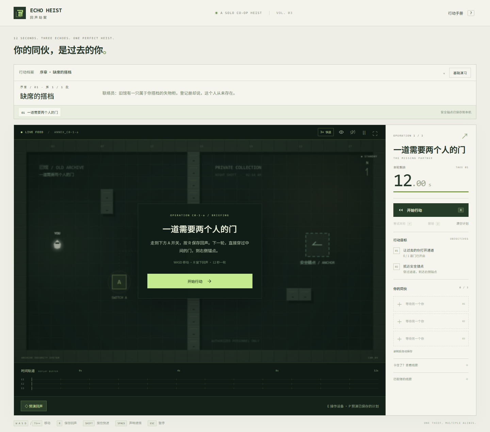
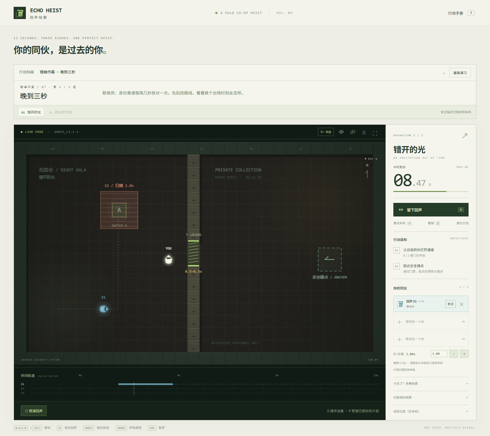
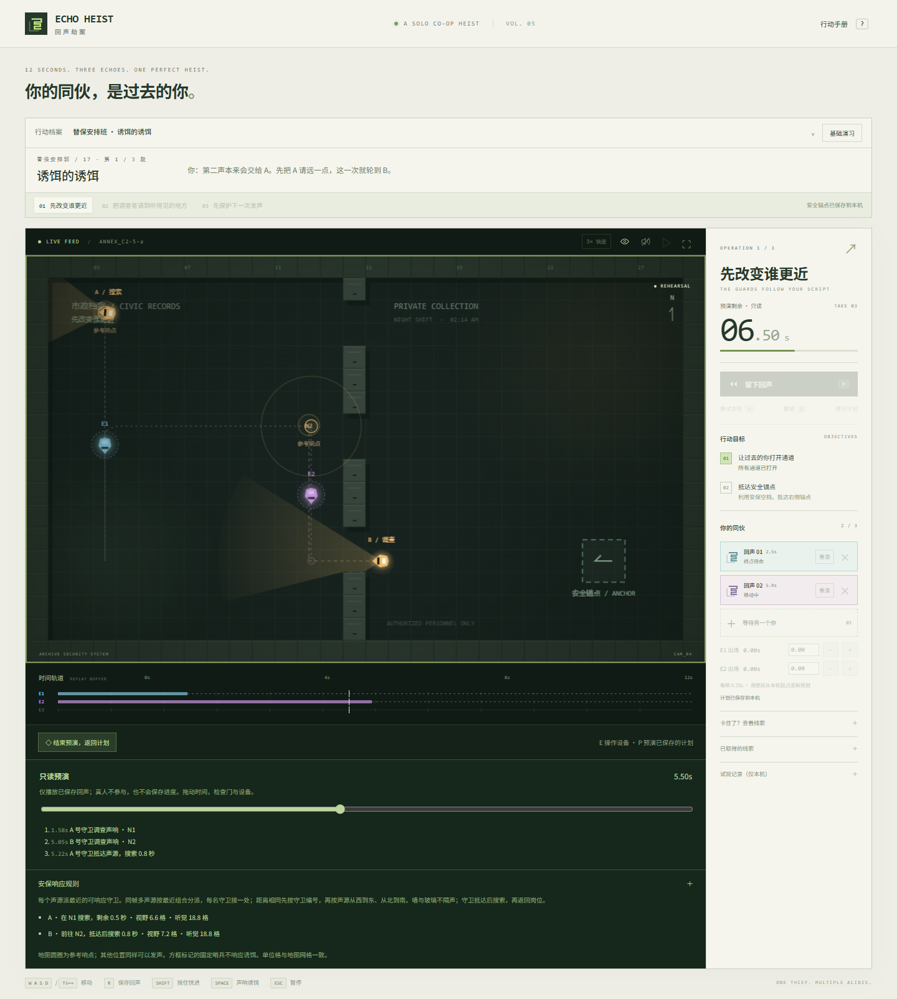
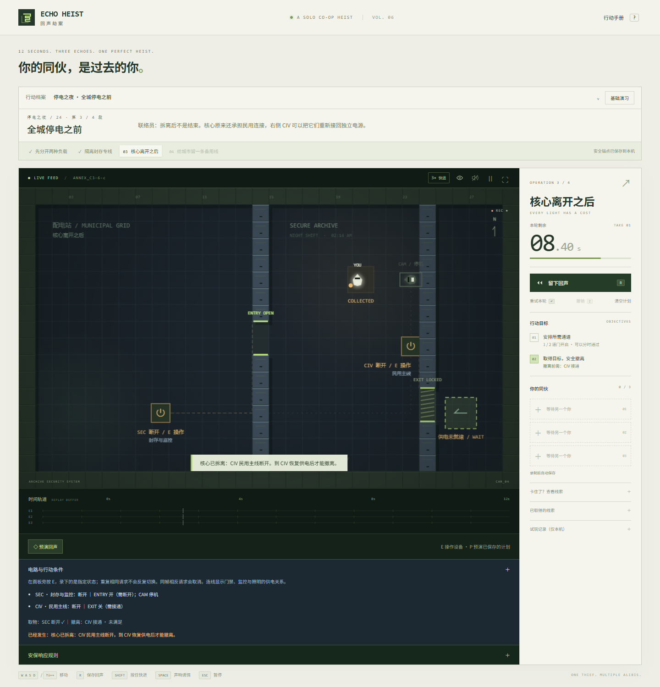
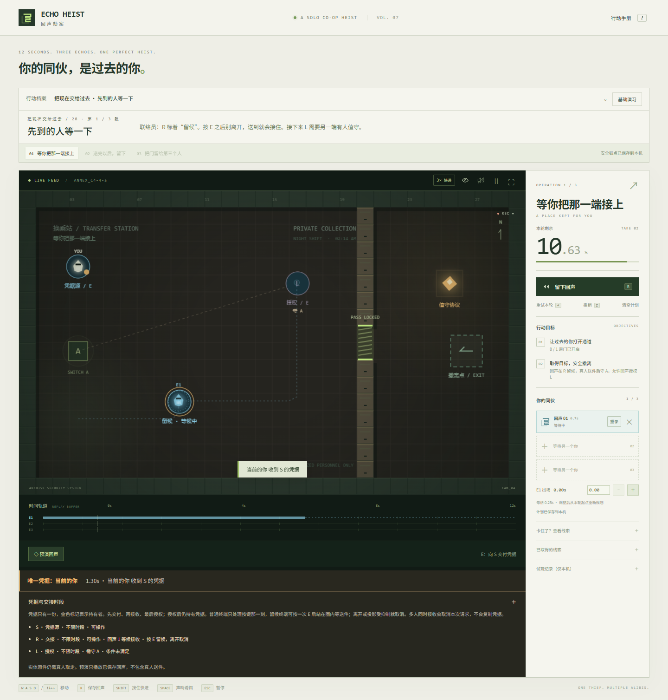
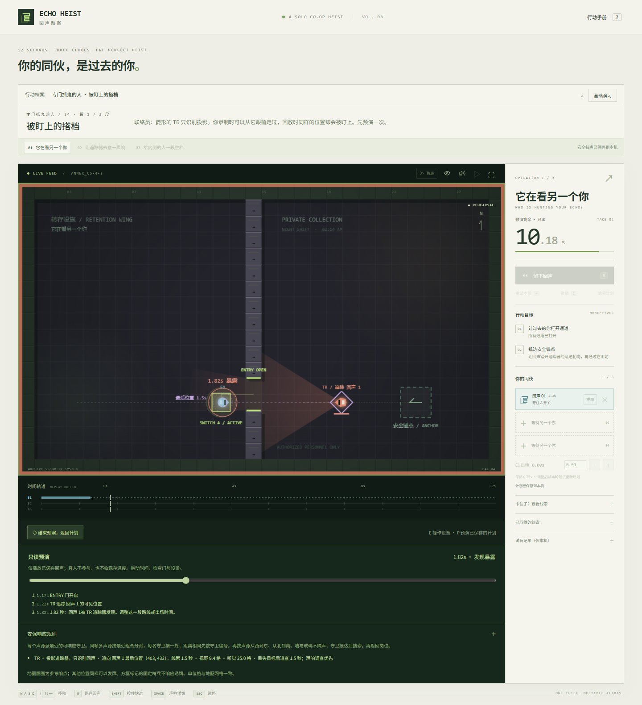
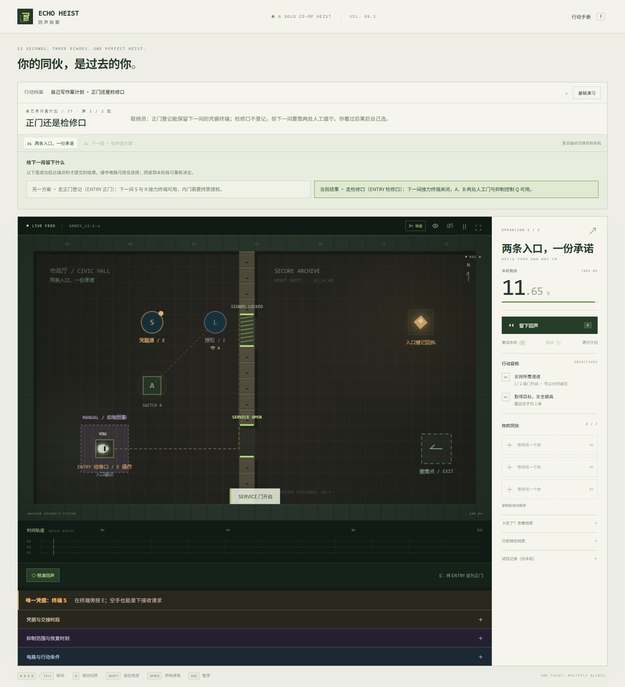
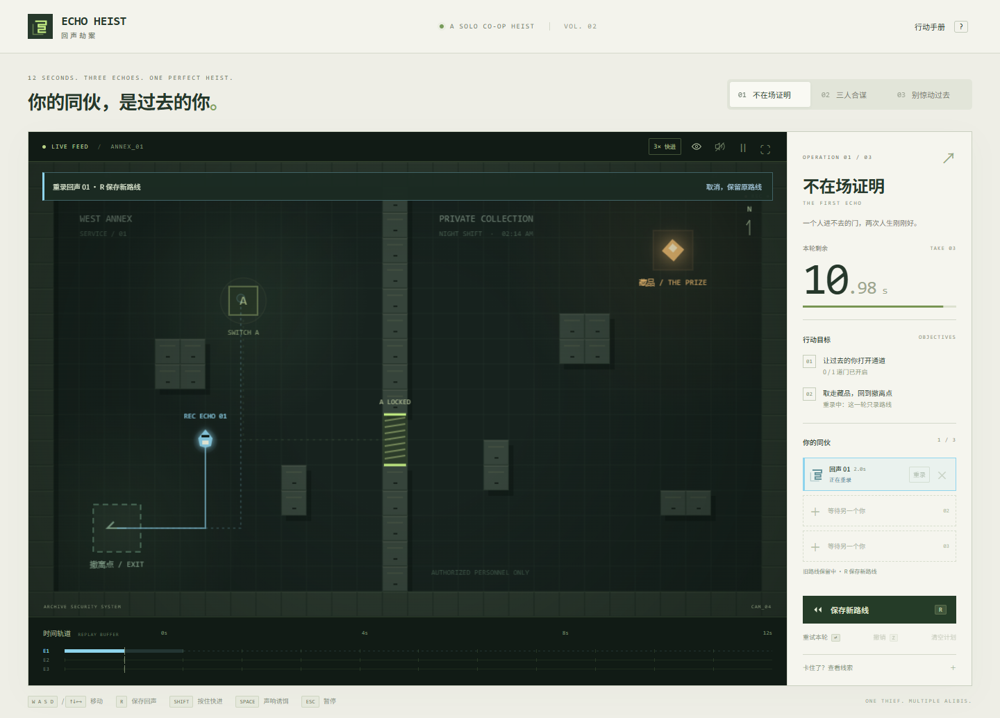

# ECHO HEIST / 回声劫案

**你的同伙，是过去的你。** 一款关于 12 秒时间循环的单人合作潜入解谜游戏。

每一轮录制你的移动和声响。下一轮，过去的你会精确重演：压住开关、打开通道，也可能引来守卫。安排最多三个回声，让现在的自己拿走藏品并撤离。



## 当前版本 v0.8.1

默认进入故事序章「昨天的搭档」：六个任务、十个手工行动区，追查一位从公共记录中消失的旧搭档。成功后保存安全锚点，刷新继续下一阶段；点击阶段名称可回退，之后的阶段重新规划。原有三关保留在「基础演习」。

完成序章后继续 C1「错峰作案」：六个任务、十六个行动区。在拍卖会上安排延迟出场、双人核验、轮换岗位和两次开门，最后带走指向 B-17 去向的账本与回执。章末回执室支持一次往返录像和两人检修通道两种方案。



C2「替保安排班」包含六个任务、十七个行动区。玻璃挡住身体却不遮视线；每处声源由最近的可响应守卫调查，固定哨兵不理诱饵。先用第一声改变守卫的位置，再让第二声分给需要调离的人。四段章末行动以取走转运总表和供电记录封条收束，最后一段支持回声开门与零回声时序门两种方案。



C3「停电之夜」包含六个任务、十七个行动区：同一分流器开门也会启动摄像头；熄灯能缩短视野，但守卫仍听得见，也可能锁住安全门。回声按明确的状态请求接线，依次为入口、取物和回程供电。章末拆离证据核心后，必须亲手恢复民用供电才能撤离，再为泵站接好备用线。



C4「把现在交给过去」包含六个任务、十八个行动区。先录下空手接收，再由真人送来唯一凭据；安排多棒交接、延迟出场、留候、远端值守与连续授权。车站货单仍由真人取走，取件后需恢复出口放行。章末可通过凭据接力进入，也可录下内侧人工放行，为下一轮打开检修门。剧情找回 B-17 主动留下的授权链，继续追查防投影设施。



C5「专门抓鬼的人」包含六个任务、十八个行动区。周期抑制不会暂停录像或丢失凭据，却会让操作和留候请求失效；真人需要接管场内岗位。追踪器只识别回声，沿最后可见位置追查，声响能改派调查、断电能清除目标。章末取件会同时启动抑制与追踪，先停追踪再恢复同伙；最后可选择双回声诱导或单回声断电，带走抹除批准书和联络员留下的签名。



C6「自己写作案计划」已加入前三个任务、八个行动区。选择正门或检修口会改变下一间可用的终端与人工门；先记录或先通信会交换两份证明的取得顺序；留灯或留门会改变后续的签名、监控和巡逻视距。成功才提交选择，刷新保留，回退清除后续结果，各分支录像分别保存。两种通信顺序都能独立核验 B-17 仍活着，并找到城外旧渡口地址。C6 后三个任务仍在制作，主线累计 **39 个任务、104 个行动区**，四种额外分支布局不重复计入体量。



行动档案另提供四个机制试验：延迟出场、电路、唯一凭据接力、回声抑制。回声可延迟 0–6 秒出场，界面提示末尾截断；E 操作设备，P 进入只读预演并拖动时间检查结果。失败时显示暴露主体、守卫与时间。

周期扫描、门禁窗口、守卫响应、电路和凭据接力都可预演，C1–C5 的提示按观察、关系、具体安排逐层展开。「安保响应规则」显示调查对象、搜索倒计时与视听范围；「电路与行动条件」显示实际供电、连带设施、取物与撤离条件，以及取物后果预告；「凭据与交接时段」显示持有者、开放倒计时、等候接收者与远端条件。打开规则面板时暂停行动。可在「试玩记录（仅本机）」自愿记录实际用时、提示与失败并导出 JSON；不会自动上传。验收方式见 [试玩与时长审查](docs/playtesting.md)。

新增「抑制范围与恢复时刻」面板，列出每层的供电、周期、恢复倒计时和受影响的回声。追踪器用菱形轮廓区分，显示原巡逻路线与最后可见位置；其视野不识别真人，其他守卫与摄像头仍按各自规则工作。

这是长期计划的前六章及 C6 前三个任务可玩初稿，主线时长尚未经过真人盲测。完整实现边界见 [制作进度](docs/production-status.md) 和 [完整目标审查](docs/goal-audit.md)，新关卡制作方式见 [作者指南](docs/authoring.md)。

## 长期开发方向

方向已确定为**潜入解谜为主，重视精妙配合与剧情**。已整理 [长期设计计划](docs/long-term-plan.md)、[48 个主线任务的内容目录](docs/mission-outline.md) 和 [机器可读的时长预算](docs/campaign-budget.json)。完整方案按八章、约 12.5 小时主线设计，并规定至少十小时目标的真人测试口径；目前 C0–C5、C6-1 至 C6-3 与四个机制样例已可玩，C6 后半章和 C7 仍待制作。预算不是实测时长。

## 本地运行

需要 Node.js 20.19+ 或 22.12+。

```sh
npm install
npm run dev
```

打开 <http://127.0.0.1:5173>。开发服务器只监听本机。若端口已占用，Vite 会明确退出，不会悄悄换端口。

```sh
npm test          # 确定性游戏逻辑与三关完整通关测试
npm run build    # TypeScript 检查 + 生产构建
npm run check:content # 检查设施引用、任务事实和全部新行动区的参考解
npm run preview  # 预览生产版本，http://127.0.0.1:4173
```

浏览器测试：

```sh
npx playwright install chromium
npm run test:browser
```

也可以通过 `PLAYWRIGHT_CHANNEL=chrome` 或 `msedge` 使用已安装的浏览器。例如 PowerShell：`$env:PLAYWRIGHT_CHANNEL='chrome'; npm run test:browser`。测试使用隔离的临时浏览器上下文，不读取个人浏览器资料。

## 操作

| 按键 | 行为 |
| --- | --- |
| WASD / 方向键 | 移动 |
| R | 保存本轮为回声；重录时替换原路线 |
| Enter | 重试本轮，保留已录制的回声 |
| Shift（按住） | 以三倍速度推进整个模拟，松开恢复正常 |
| Z | 撤销上次录制、重录、删除或清空 |
| E | 操作附近电源，或在终端接收、交付、授权凭据 |
| P | 开启 / 关闭只读回声预演 |
| Space | 制造声响，吸引附近守卫，有 1.5 秒冷却 |
| Esc | 暂停 / 继续 |
| ? | 打开行动手册 |

点击回声卡片的「重录」可单独修改一名同伙，× 可删除单条回声。顶部按钮可按住快进、切换路线显示、音效和全屏。音效默认关闭；触摸设备提供方向按钮。推荐使用桌面键盘游玩。

## 回声编排

- **延迟出场**：回声下方以 0.25 秒调整出场，也可直接输入秒数，最多延后 6 秒。出场前不压开关、不发声、不会被看见；被十二秒上限截断的末尾会明确提示。编辑数值会暂停，调整后重回待命，可用 Z 撤销。
- **只读预演**：按 P 后拖动时间，查看已保存回声如何开门、操作设备或暴露。真人不参与；不会写入计划、完成任务或发放证据。预演关闭后恢复正式行动。
- **设备意图**：E 操作会记录到录像中。凭据是唯一信息实例，可以在标记终端交接，实物藏品仍只有真人能取走。接收条件尚不具备时，也可先录下请求。

- **单条重录**：选中的旧回声暂时退场，其他同伙继续播放。当前角色会使用该回声的颜色，实线显示新路线，虚线保留旧路线作参考。这一轮只录路线，不能领取藏品。
- **保存或取消**：按 R 将新路线写回原槽，保留编号、颜色和其余同伙。也可以取消重录，完整恢复旧路线。失败后重试仍在重录模式，12 秒用尽会自动保存新路线，满槽也可重录。
- **撤销计划修改**：Z 最多回退本次关卡内的 20 次计划修改，包括误删和清空。重录中先保存或取消，再撤销。
- **按住快进**：Shift 或顶部 3× 按钮以三倍速度推进角色、回声、警卫和计时；记录仍按游戏时间回放。暂停、失焦和循环结束后解除快进。
- **自动保存**：已提交的计划按关卡保存在本机。刷新、关闭页面、切换关卡后会恢复已录好的回声，从待命状态重新开始。未提交的草稿、当前轮进度及撤销历史不保存。
- **实时状态**：回声卡片显示移动、等待、守住哪个开关或终点待命，方便定位需要重录的同伙。



## 规则

- 每轮 12 秒，最多保存三个回声。
- 提前按 R 后，回声在下轮到达录制终点后会一直留在那里。
- 回声会触发开关、重放声响，也会被守卫发现。
- 回声是绝对位置的投影：不会被后来关闭的门阻挡；不能拿走藏品。
- 时限结束且仍有空槽时自动保存回声；满槽时提示重试或选择重录，不自动覆盖旧录制。
- 接触金色藏品自动拾取，携带它抵达标记的撤离区即通关；只要求抵达安全锚点的行动区无需取物。
- 扫描带周期性工作，连续暴露 0.3 秒会失败。门可要求多人同时到岗、恰好一人、全部离岗，并叠加明确的时间窗口。
- C2 每个声源派最近的可响应守卫；同帧多声源按距离配对，每名守卫只接一处，距离相同按守卫编号与声源位置排序。抵达后搜索再返回岗位。普通墙和玻璃不隔声，固定哨兵忽略声音。C0 与基础演习保留原有范围内共同响应规则。
- 摄像头固定朝向且不响应声音，断电后停止感知。照明熄灭只缩短相关守卫的视距，不影响听觉。电路可以要求某种状态才能取物或撤离；已预告的核心拆离会改变供电，提前接通不能抵消之后的断开。只读预演不含真人取物，因此不会触发拆离后果。
- 切换窗口会自动暂停。通关成绩与各关卡已提交的回声计划保存在本机 localStorage。
- 切换关卡保留已提交的计划，放弃未提交的重录草稿。

## 三个基础演习

1. **不在场证明**：留一个自己压住开关，下一轮穿门、取物、撤离。
2. **三人合谋**：两名回声依次控制两道门。
3. **别惊动过去**：在双门合作中加入巡逻、视野遮挡和声响诱饵。

这些演习保留原有规则与通关路线。可通过「基础演习」按钮或 `/?mode=training` 进入。尚不支持剪辑录像中的某一段，也没有在线功能或拖放式关卡编辑器。

## 代码结构

- `src/engine.ts`：独立于 DOM 的固定 60Hz 模拟、碰撞、录制、警卫、通关。
- `src/levels.ts`：三个关卡和共享数据类型。
- `src/render.ts`：Canvas 2D 画面、动态视锥、轨迹、灯光与回声效果。
- `src/main.ts`：输入、界面、音效事件、进度保存和帧循环。
- `src/audio.ts`：Web Audio 合成音效。
- `src/plans.ts`：带版本和边界校验的计划存档格式。
- `src/campaign-content.ts`：六个序章任务、四个机制试验及可执行参考输入。
- `src/chapter-one.ts`：拍卖会六个正式任务及章末替代解。
- `src/chapter-two.ts`：市政档案库六个任务、声响链及章末安静路线。
- `src/chapter-three.ts`：配电站六个任务、供电冲突、核心拆离及民用恢复。
- `src/campaign-authoring.ts`：地图、设施和参考输入的作者辅助函数。
- `src/campaign.ts`：任务解锁、安全锚点、阶段回退和主线存档。
- `src/campaign-ui.ts`：行动档案、剧情通讯、回声延迟与预演界面。
- `src/witness.ts`、`scripts/validate-content.ts`：八方向参考输入回放与关卡内容检查。
- `src/playtest.ts`、`src/playtest-ui.ts`：自愿启用的本机试玩记录与 JSON 导出。
- `src/playtime-audit.ts`、`scripts/audit-playtime.ts`：真人试玩材料的时长审查；没有完整内容和人工审核时不能通过。
- `src/style.css`：响应式控制台界面。
- `src/planning.css`：重录、快进和计划状态的界面。
- `tests/game.test.ts`：游戏规则和实际关卡路线测试。
- `tests/planning.test.ts`：重录、撤销、状态和存档校验测试。
- `tests/browser/game.spec.ts`：真实键盘通关、录制编排、快进、存档恢复与移动端检查。

画面与音效由代码生成，不需要 API key、后端或远程素材。安装依赖后可以断网运行。

## 开发约定

本项目按创建者要求直接在 `main` 开发。提交前运行测试和生产构建。
