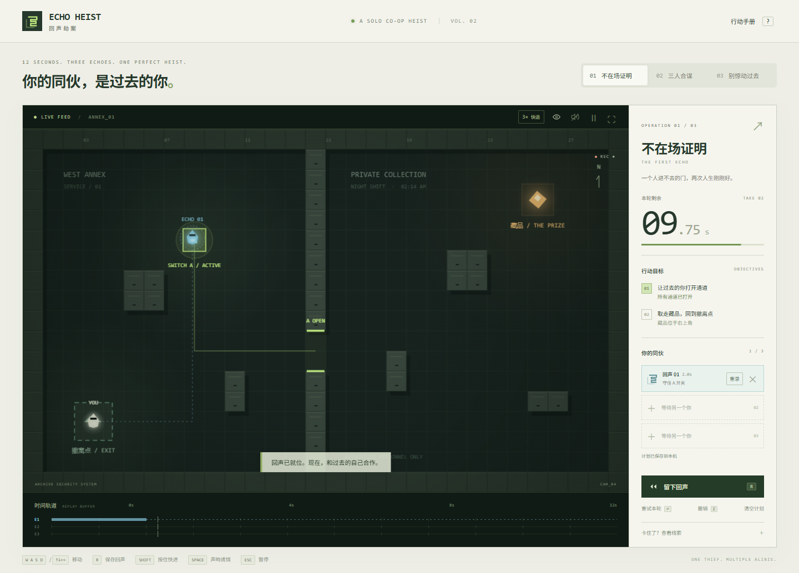

# ECHO HEIST / 回声劫案

**你的同伙，是过去的你。** 一款关于 12 秒时间循环的单人合作潜入解谜游戏。

每一轮录制你的移动和声响。下一轮，过去的你会精确重演：压住开关、打开通道，也可能引来守卫。安排最多三个回声，让现在的自己拿走藏品并撤离。



## 本地运行

需要 Node.js 20.19+ 或 22.12+。

```sh
npm install
npm run dev
```

打开 <http://127.0.0.1:5173>。开发服务器只监听本机。若端口已占用，Vite 会明确退出，不会悄悄换端口。

```sh
npm test          # 确定性游戏逻辑与三关完整通关测试
npm run build    # TypeScript 检查 + 生产构建
npm run preview  # 预览生产版本，http://127.0.0.1:4173
```

浏览器测试：

```sh
npx playwright install chromium
npm run test:browser
```

也可以通过 `PLAYWRIGHT_CHANNEL=chrome` 或 `msedge` 使用已安装的浏览器。例如 PowerShell：`$env:PLAYWRIGHT_CHANNEL='chrome'; npm run test:browser`。测试使用隔离的临时浏览器上下文，不读取个人浏览器资料。

## 操作

| 按键 | 行为 |
| --- | --- |
| WASD / 方向键 | 移动 |
| R | 保存本轮为回声；重录时替换原路线 |
| Enter | 重试本轮，保留已录制的回声 |
| Shift（按住） | 以三倍速度推进整个模拟，松开恢复正常 |
| Z | 撤销上次录制、重录、删除或清空 |
| Space | 制造声响，吸引附近守卫，有 1.5 秒冷却 |
| Esc | 暂停 / 继续 |
| ? | 打开行动手册 |

点击回声卡片的「重录」可单独修改一名同伙，× 可删除单条回声。顶部按钮可按住快进、切换路线显示、音效和全屏。音效默认关闭；触摸设备提供方向按钮。推荐使用桌面键盘游玩。

## 回声编排

- **单条重录**：选中的旧回声暂时退场，其他同伙继续播放。当前角色会使用该回声的颜色，实线显示新路线，虚线保留旧路线作参考。这一轮只录路线，不能领取藏品。
- **保存或取消**：按 R 将新路线写回原槽，保留编号、颜色和其余同伙。也可以取消重录，完整恢复旧路线。失败后重试仍在重录模式，12 秒用尽会自动保存新路线，满槽也可重录。
- **撤销计划修改**：Z 最多回退本次关卡内的 20 次计划修改，包括误删和清空。重录中先保存或取消，再撤销。
- **按住快进**：Shift 或顶部 3× 按钮以三倍速度推进角色、回声、警卫和计时；记录仍按游戏时间回放。暂停、失焦和循环结束后解除快进。
- **自动保存**：已提交的计划按关卡保存在本机。刷新、关闭页面、切换关卡后会恢复已录好的回声，从待命状态重新开始。未提交的草稿、当前轮进度及撤销历史不保存。
- **实时状态**：回声卡片显示移动、等待、守住哪个开关或终点待命，方便定位需要重录的同伙。


## 规则

- 每轮 12 秒，最多保存三个回声。
- 提前按 R 后，回声在下轮到达录制终点后会一直留在那里。
- 回声会触发开关、重放声响，也会被守卫发现。
- 回声是绝对位置的投影：不会被后来关闭的门阻挡；不能拿走藏品。
- 时限结束且仍有空槽时自动保存回声；满槽时提示重试或选择重录，不自动覆盖旧录制。
- 接触金色藏品自动拾取，携带它返回起点的撤离区即通关。
- 切换窗口会自动暂停。通关成绩与各关卡已提交的回声计划保存在本机 localStorage。
- 切换关卡保留已提交的计划，放弃未提交的重录草稿。

## 三个关卡

1. **不在场证明**：留一个自己压住开关，下一轮穿门、取物、撤离。
2. **三人合谋**：两名回声依次控制两道门。
3. **别惊动过去**：在双门合作中加入巡逻、视野遮挡和声响诱饵。

这是一个可玩的垂直切片，目标是验证回声协作的乐趣。支持整条回声重录，尚不支持剪辑录像中的某一段，也没有在线功能或完整关卡编辑器。

## 代码结构

- `src/engine.ts`：独立于 DOM 的固定 60Hz 模拟、碰撞、录制、警卫、通关。
- `src/levels.ts`：三个关卡和共享数据类型。
- `src/render.ts`：Canvas 2D 画面、动态视锥、轨迹、灯光与回声效果。
- `src/main.ts`：输入、界面、音效事件、进度保存和帧循环。
- `src/audio.ts`：Web Audio 合成音效。
- `src/plans.ts`：带版本和边界校验的计划存档格式。
- `src/style.css`：响应式控制台界面。
- `src/planning.css`：重录、快进和计划状态的界面。
- `tests/game.test.ts`：游戏规则和实际关卡路线测试。
- `tests/planning.test.ts`：重录、撤销、状态和存档校验测试。
- `tests/browser/game.spec.ts`：真实键盘通关、录制编排、快进、存档恢复与移动端检查。

画面与音效由代码生成，不需要 API key、后端或远程素材。安装依赖后可以断网运行。

## 开发约定

本项目按创建者要求直接在 `main` 开发。提交前运行测试和生产构建。
