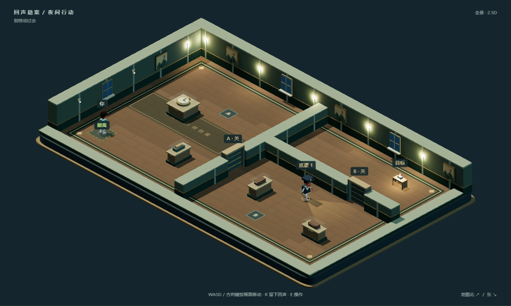

# ECHO HEIST / 回声劫案

一个关于配合、身份和记忆归属的 2.5D 潜入解谜游戏。你的同伙是过去十二秒里的自己：录下行动、安排回声出场，再让现在的你完成交接、取证与撤离。

当前版本 **0.18.0**。八章主线、48 个任务、130 个必经行动区，另有 14 个分支布局、4 个机制演习和 3 个基础演习。所有内容本地运行，支持单 HTML 离线版。



场景采用真实 3D 模型、骨骼动画、材质与实时阴影，以固定等距镜头游玩。旧馆使用木地板镶边、城市旧影和失物展柜，[车站场景](docs/scene-v017-station.png)使用石材分区、时钟与双面交接柜。玩家、普通守卫、追踪器和回声分别有不同的服饰轮廓，凭据显示在实际持有者手中或柜槽里。

0.18 补齐其余六章的空间风格：[拍卖会](docs/scene-v018-gala.png)的帘幕与地毯、[市政档案](docs/scene-v018-records.png)的文件架、[配电站](docs/scene-v018-power.png)的管线与拨杆柜、[转存设施](docs/scene-v018-retention.png)的吸声板、[市政厅](docs/scene-v018-civic.png)的石材与登记柜、[中央总库](docs/scene-v018-vault.png)的金属库门。电源拨杆和危险区灯读取真实规则状态。

点击地图工具栏的「近景 / 全景」切换观察距离；前景墙切低，靠近且挡住玩家的墙自动降低。标签避开人物轮廓，并以引线关联原目标，手机按实际画面尺寸渲染。

## 开始

[下载 v0.18.0 离线版](https://github.com/Sskift/echo-heist/releases/tag/v0.18.0)：解压 ZIP 后，用 Chrome 或 Edge 打开 HTML；模型、动画、音乐和许可均在包内。

```sh
npm ci
npm run dev
```

打开 http://127.0.0.1:5173 。首次进入会从修表铺开场；`/?mode=training` 可直接进入基础演习。

本轮新作可从 [《不存在的列车票》独立试玩](http://127.0.0.1:5173/?demo=station-transfer) 直接开始，与主线分开存档。登记厅交出的唯一凭据，在对侧站台必须由本人接回，再交到货运档案区完成接班。FAST 前期需要同伙与时段，后两区各省一个岗位；SERVICE 随时交票，后段需要额外接应。

[《最后一盏灯》独立试玩](http://127.0.0.1:5173/?demo=last-light) 仍可直接进入。主线中的位置是「停电之夜」章末 C3-6。

这是一场三段连续行动：在配电室留一名回声守住 HOLD，隔着观察窗配合取出核心，再回到同一间配电室恢复民用供电。提前解锁检修口会改变下一段入口和回程路线；乘货梯省下前期绕行，回程则需要手动接应。留守者按实际录像重放，占用三个名额中的一个，预演、重试和刷新均保留。各区使用同步的 12 秒节拍；回到首段重排时，后段锚点和本区计划会撤销。

| 操作 | 按键 |
| --- | --- |
| 按画面方向移动 | WASD / 方向键 |
| 留下回声 / 开始录制 | R |
| 操作设备、交接、植入 | E |
| 制造声响 | Space |
| 暂停 / 继续 | Esc |
| 重试本轮 / 继续下一段 | Enter |
| 撤销计划修改 | Z |
| 只读预演 | P |
| 按住三倍快进 | Shift |

也有触摸方向键。右上角的行动手册说明完整规则。声音默认关闭，可用喇叭、故事里的声音按钮或「声画」开启；音乐和音效可分别调节。

地图北向右上、东向右下；按键始终对应屏幕方向。原有录像继续按原始世界坐标精确回放。建议使用支持 WebGL 2 的 Chrome 或 Edge；模型、动画、音乐均内嵌在离线包中。

## 故事与修表铺

搭档失踪后，公共登记册里也没有了他的名字。你沿着编号 B-17 调查私人记忆的交易、转运与身份抹除，直到把责任证据送进独立登记链。

主线包含 20 段开场、章间与关键事件对话。每段在相应任务到达或完成后出现，阅读暂停计时，可收起、逐页续读或跳过。「修表铺 · 故事与线索」随时回顾已解锁故事和已取得证据。未解锁任务的详情不会提前透露。

两次幕间回答影响后续人物台词与尾声，跳过不代选；回看保留原回答。关卡中的入口、电路、凭据等选择仍通过实际行动提交，最终公开或归还私人档案也保留两个不同结局。

剧情、回声计划、任务锚点与声画偏好分别保存在本机。旧版任务存档可以继续使用，会从当前章节补入新叙事；过去的幕间留在修表铺供自选回看，不要求从头阅读。

## 开发与验证

```sh
npm test                 # 25 个核心机制、存档与叙事状态检查
npm run check:content    # 所有关卡参考路线与分支提交，仅在这里检查一次
npm run build           # 严格类型检查、未使用代码检查与生产构建
npx playwright install chromium
npm run test:browser    # 8 个主要用户流程，含 3D 资源与画面方向输入
npm run package:offline # 生成 .local/releases/echo-heist-v0.18.0.html
```

Windows 可设置 `$env:PLAYWRIGHT_CHANNEL='chrome'` 使用已安装的 Chrome。关卡参考路线使用真实模拟输入，验证可完成性；不代表真人首玩难度或实际时长。

0.14 移除了重复的章节单元测试和浏览器通关脚本，退役试玩计时、时长审查与扰动扫描工具。CI 保留核心检查、一次全内容验证和少量浏览器流程，不再用多套脚本重复证明同一条解法。

## 文件

- `src/engine.ts`：独立于浏览器的固定 60 Hz 模拟；精确回放、终点值守、最多三个回声。
- `src/campaign*.ts`、`src/chapter-*.ts`：关卡、任务锚点、分支与结局。
- `src/story.ts`：完整幕间剧本、解锁规则与对话存档。
- `src/story-ui.ts`、`src/story.css`：修表铺插图、阅读器与调查回顾。
- `src/scene3d.ts`、`src/models3d.ts`、`src/set-dressing.ts`：3D 场景、骨骼服饰、各章陈设、等距镜头与实际规则提示。
- `src/isometric.ts`：画面方向输入转换；原始模拟与录像坐标不变。
- `src/audio.ts`、`src/soundtrack.ts`：离线配乐、音效与场景混音。
- `src/plans.ts`：回声计划存档；`src/witness.ts`：内容作者的参考路线执行器。

[下一步制作计划](docs/next-steps.md) · [制作状态](docs/production-status.md) · [叙事编排](docs/story-bible.md) · [关卡创作](docs/authoring.md) · [素材与许可](docs/assets.md)
